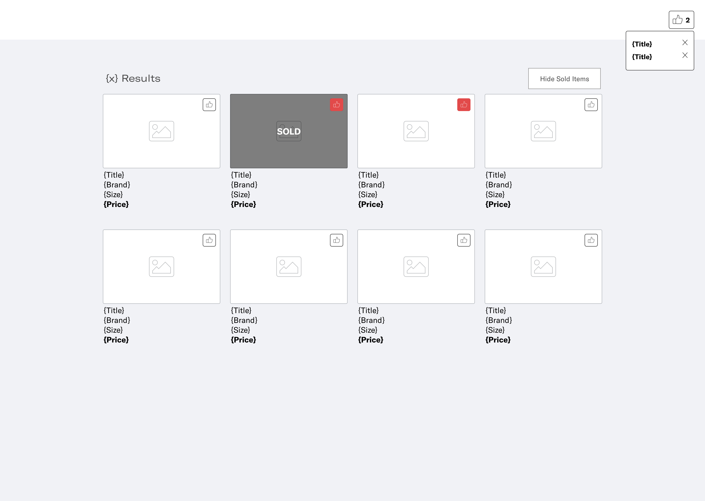

# Instructions

A few notes before you start:

- Don't go crazy! Your free time is important to us.
- Don't worry if you don't have the time to finish the entire exercise or you get stuck.
- In a team communication is important and we like to share ideas, solutions and problems together!

## Exercise

This task is to create a basic shop page

A simple design can be found here for guidance: 

The API for the product data is available at: `https://5c78274f6810ec00148d0ff1.mockapi.io/api/v1/products`

### Requirements

- Retrieve data from the given API endpoint;
- Display the list of products;
- Add functionality to like/unlike a product;
- Add functionality to show/hide sold items;

### Tips

- Consider what makes a good application that will go into production
- You can use any library you want. (A good starting point to setup a modern web app is with "Create React App")
- A tested component is a reliable component!
- A readme detailing how to run the project and any notes you'd like to leave is always appreciated
